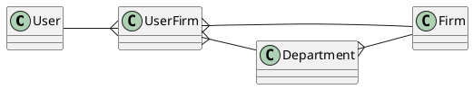
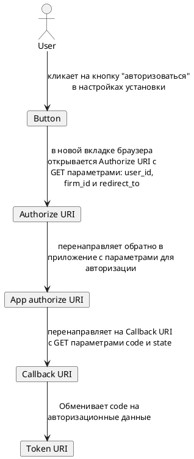

# Тренировочный проект Laravel

Площадка для экспериментов с современным [laravel][laravel] & [vue 3][vue-3].

## Запуск проекта

Для запуска проекта у вас должны быть установлены:
* [git][git-install]
* [docker][docker-install]
* [docker-compose][docker-compose-install]

Когда всё необходимое ПО установлено, вы можете воспользоваться
следующей командой для запуска проекта:

```bash
git clone git@github.com:Bolid1/mysmartchoice-core.git projectName
cd projectName
docker-compose up -d
```

Теперь сайт доступен по адресу [http://localhost](http://localhost)

## Доступы и права

В этом проекте используется неклассическая схема с распределением прав
доступа для каждого пользователя.

Мы предусмотрели возможность, что контент принадлежит не конкретному
человеку, а группе лиц, объединенных в одну компанию.

### Базовая организация связей

Схема сущностей выглядит так:



Пользователь может состоять во множестве фирм,
в то же время, в каждой фирме работает множество пользователей.
Связь между пользователем и фирмой описывается объектом `UserFirm`.

В реальной жизни, фирмы поделены на отделы,
каждый отдел занимается своими задачами,
которые требуют различные уровни доступа.

### Gates & Policies

Когда мы хотим проверить, может ли пользователь
взаимодействовать с контентом фирмы,
мы должны ответить на следующие вопросы:

* Пользователь состоит в фирме?
* Отдел пользователя имеет разрешение на требуемое взаимодействие с указанным контентом?
* Сам пользователь имеет разрешение на требуемое взаимодействие с указанным контентом?

> В этот момент разработчик должен ответить себе на вопрос:
> если уровень доступа пользователя выше,
> чем уровень доступа отдела, в котором он работает,
> надо ли разрешать ему доступ? <br/>
> Если да, то требуется изменить код в `todo`

В laravel предусмотрены специальные классы для работы
с правами: [gates][laravel-gates] & [policies][laravel-policies].

Gate описывает как проверить доступ пользователя к отдельному функционалу,
он отвечает на вопрос "может ли пользователь сделать это?".

Policy объединяет gates относящиеся к одной сущности.

В документации Laravel описано как писать и
использовать policies & gates, но т.к. у нас более сложная
структура прав, чем обычно, то и проверка прав имеет свои особенности.

Например, в методе `\App\Policies\AccountPolicy::create`, отвечающим на
вопрос "может ли пользователь создать аккаунт?", вы можете заметить `Firm`
в качестве аргумента, т.к. аккаунт создаётся для фирмы,
и будет принадлежать фирме. Таким образом, вопрос трансформируется
в "может ли пользователь создать аккаунт в указанной фирме?".

Чтобы описанное выше работало, в механизме подключения `Policy`
к `Controller` через метод `authorizeResource` необходимо
указать дополнительные параметры, например так:

```php
$this->authorizeResource(Account::class.',firm', 'account,firm');
```

### Role-based access

Кроме пользователей, приложение, также, использует команда обслуживания.
Это разработчики, менеджеры, администраторы и бухгалтера.

Каждая из указанных групп имеет собственные доступы, например,
менеджер может иметь доступ к любой сущности в пределах
одной или нескольких фирм. Старший разработчик, в то же время,
может иметь доступ ко всем данным и сущностям в системе,
дабы иметь возможность воспроизвести поведение любого пользователя.

Модель `Role` хранит в себе список доступных действий,
при этом, т.к. у пользователя единовременно может быть только одна роль,
то принадлежность роли хранится прямо в свойствах модели `User`.

В отличие от обычной проверки прав, для ролей используются
специальные [interceptors][laravel-policies-intercepting].

## OAuth токены и клиенты

> Данный раздел документации рассчитан на то, что вы уже
> ознакомились с документацией к [Laravel Passport][laravel-passport].

Стандартный функционал Laravel Passport был дополнен для поддержки
прав в проекте. Также у разработчика уже есть готовый frontend
для взаимодействия с клиентами и токенами.

В рамках работы над проектом, стандартный функционал был дополнен,
были добавлены следующие классы и файлы:

* В файле [config/oauth/scopes.php](./config/oauth/scopes.php) содержится список
  как динамических, так и статических scopes приложения.
* С помощью [DynamicScopesBuilder](./app/Services/DynamicScopesBuilder.php) и
  переопределения [ScopeRepository](./app/Repositories/ScopeRepository.php)
  реализован механизм динамических scopes, который будет описан далее.
* [ScopesController.php](./app/Http/Controllers/Api/OAuth/ScopesController.php) позволяет
  получить список возможных scopes, включая динамические.
* Для клиентов подготовлены собственные [API](./app/Http/Controllers/Api/OAuth/ClientsController.php)
  & [Web](./app/Http/Controllers/Web/OAuth/ClientsController.php) контроллеры,
  с помощью которых ограничен доступ к управлению клиентами.

### Динамические scope-ы

К сожалению, в стандартном функционале нет возможности указывать,
что токен может принадлежать множеству сущностей одновременно, всё завязано
на конкретного пользователя.

Для решения этой проблемы, был добавлен механизм динамических scope-ов,
позволяющий использовать шаблоны при формировании списка scope-ов.

> Важно помнить, что при проверке прав, учитываются не только scope-ы
> токена, но также и права пользователя, которому принадлежит токен.

#### Как это работает

Когда необходимо добавить новый scope для контента,
принадлежащего фирме, в массив под
ключом `patterns` файла [config/oauth/scopes.php](./config/oauth/scopes.php) необходимо
добавить новый элемент.

В качестве ключа необходимо использовать шаблон, в котором будет производиться
замена `{firm}` на идентификатор фирмы, а в качестве значения - массив, содержащий:

| Ключ        | Значение
| ----------- | --------
| pattern     | regexp для поиска идентификатора фирмы в будущем
| description | краткий текст, описывающий к какому функционалу получит доступ приложение, владеющее token-ом с указанным scope

### Policies

У OAuth клиентов есть [своя реализация](./app/Policies/OAuth/ClientPolicy.php) Policy,
ограничивающая доступ тем или иным пользователям, а также сторонним приложениям,
действующим от имени пользователя.

## Интеграции

Приложения, которые расширяют базовый функционал приложения за
счёт сторонних сервисов называются интеграциями.

Проект даёт возможность каждому пользователю создавать собственные интеграции,
которые, после прохождения модерации, сможет установить любой пользователь системы.

На данный момент с помощью интеграций возможно:

* Получить токен другого пользователя
* Отобразить информацию об интеграции в разделе
  её настроек, после того, как интеграция будет установлена

### Авторизация через OAuth 2.0

Если для работы интеграции требуется токен доступа от приложения,
создателю интеграции необходимо создать OAuth Client (`/oauth/clients`),
после чего необходимо создать 2 endpoint-а:

1. Authorize URI отвечает за перенаправление пользователя в приложение
   для получения разрешение на выдачу прав доступа.
2. Callback URI используется для обмена кода на токен доступа.

Схема взаимодействия выглядит следующим образом:



> Если вы используете PHP, рекомендуем рассмотреть
> библиотеку [league/oauth2-client](https://oauth2-client.thephpleague.com/),
> с которой полностью совместимо текущее приложение.

Разрабатывая авторизацию такого типа следует помнить о том,
что отключение интеграции не аннулирует выданные ей доступы автоматически.

## Доработки команд создания классов

В рамках работы над приложением были переосмыслены команды создания
классов. Все они располагаются в `namespace` App\Console\Commands\Make.

Кратко, об отличиях можно посмотреть в таблице, в то же время,
каждая команда имеет подробное описание в опциях.

| Команда                        | Почему создана?
| ------------------------------ | ---------------
| make:enhanced:controller       | API & Web контроллеры сразу после создания поддерживают работу с [ресурсами][eloquent-resources] и [inertiaJs][inertiajs]
| make:enhanced:resource         | Добавлен PhpDoc для удобного взаимодействия со свойствами ресурса
| make:enhanced:test-controller  | Готовые тесты для API & Web контроллеров
| make:enhanced:view             | Генерация index, show & edit представлений для сущности в рамках vue
| make:enhanced:model            | Добавлен PhpDoc для удобного взаимодействия с моделью, а также возможность создать полностью готовый к работе компонент системы одной командой.

## API и Web контроллеры

Практика делить контроллеры на API и Web является довольно разумной,
т.к. рано или поздно различие между собираемыми ими
данными становится очевидным и уродует код.

[Ресурсы][eloquent-resources] используются только в API контроллерах,
позволяя более гибко настраивать сущности перед выдачей.

Например, зачастую в Web не требуется информация о дате создания сущности,
за счёт этого можно сэкономить трафик при передаче данных.

В то же время, в Web редко отображается информация только по ресурсу,
требуется какая-то дополнительная информация, которую можно подмешать в контроллере.

И главное отличие в том, что API контроллеры в ответ возвращают JSON,
в то время как Web контроллеры отвечают через inertiaJs Response (`\Inertia\Response`).

### Специальные запросы и менеджеры

За деление на API & Web приходится платить тем, что логика валидации, проверки прав и
обработки сущностей может быть задублирована.

Чтобы этого избежать, в laravel предусмотрены [form requests][form-request],
[policies](#Policies), а в ООП - менеджеры сущностей.

[comment]: <> (найти и вставить ссылку на менеджеры сущностей)

Т.е. обработка запроса на сохранение/изменение сущности всегда работает одинаково для
Web & API контроллеров:

* Сначала при помощи Policy или Gate действие авторизуется
* Затем запрос проверяется на соответствие правилам при помощи [form requests][form-request]
* И, наконец, обрабатывается менеджером сущности

## InertiaJs и vue 3

[InertiaJs][inertiajs] & [vue 3][vue-3] помогают создавать SPA приложения
в рамках единого с backend проекта, что несомненно несёт положительный опыт разработки.

В проекте используется [TypeScript][typescript], для этого были
предприняты [дополнительные доработки][typescript-vue-3-overflow].

Благодаря [Element-plus][element-plus] и [tailwindcss][tailwindcss] разработка интерфейсов достаточно проста,
поэтому на этом внимание не акцентируем.

## План документации

- [x] Accesses & rights
  - [x] Base organisation for relations (in progress)
  - [x] How policies are used?
  - [x] RBAC (in progress)
- [x] OAuth tokens & clients
  - [x] Overrides for base functionality of passport package
  - [x] Custom scopes list
  - [x] Access & rights for clients (in progress)
- [x] Integrations
- [x] `make:enhanced:*` functionality
- [x] API & Web controllers difference
- [x] When I should use resources?
- [x] When I should use requests?
- [x] What is "Managers" and when to use them?
- [x] When I should use validators?
- [x] Frontend
  - [x] Vue 3
  - [x] InertiaJS
  - [x] TypeScript installation
- [ ] Debugging
  - [ ] Xdebug (in progress)
  - [ ] Log collector (in progress)

[laravel]: https://laravel.com/
[vue-3]: https://vuejs.org/
[git-install]: https://git-scm.com/downloads
[docker-install]: https://docs.docker.com/engine/install/
[docker-compose-install]: https://docs.docker.com/compose/install/
[laravel-gates]: https://laravel.com/docs/8.x/authorization#gates
[laravel-policies]: https://laravel.com/docs/8.x/authorization#creating-policies
[laravel-policies-intercepting]: https://laravel.com/docs/8.x/authorization#intercepting-gate-checks
[laravel-passport]: https://laravel.com/docs/8.x/passport
[eloquent-resources]: https://laravel.com/docs/8.x/eloquent-resources
[inertiajs]: https://inertiajs.com/
[form-request]: https://laravel.com/docs/8.x/validation#form-request-validation
[typescript]: https://www.typescriptlang.org/
[typescript-vue-3-overflow]: https://stackoverflow.com/a/64213710
[element-plus]: https://element-plus.org
[tailwindcss]: https://tailwindcss.com/
