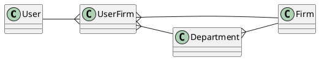

# Тренировочный проект Laravel

Площадка для экспериментов с современным [laravel][laravel] & [vue 3][vue-3].

## Запуск проекта

Для запуска проекта у вас должны быть установлены:
* [git][git-install]
* [docker][docker-install]
* [docker-compose][docker-compose-install]

Когда всё необходимое ПО установлено, вы можете воспользоваться
следующей командой для запуска проекта:

```bash
git clone git@github.com:Bolid1/mysmartchoice-core.git projectName
cd projectName
docker-compose up -d
```

Теперь сайт доступен по адресу [http://localhost](http://localhost)

## Доступы и права

В этом проекте используется неклассическая схема с распределением прав
доступа для каждого пользователя.

Мы предусмотрели возможность, что контент принадлежит не конкретному
человеку, а группе лиц, объединенных в одну компанию.

### Базовая организация связей

Схема сущностей выглядит так:



Пользователь может состоять во множестве фирм,
в то же время, в каждой фирме работает множество пользователей.
Связь между пользователем и фирмой описывается объектом `UserFirm`.

В реальной жизни, фирмы поделены на отделы,
каждый отдел занимается своими задачами,
которые требуют различные уровни доступа.

### Gates & Policies

Когда мы хотим проверить, может ли пользователь
взаимодействовать с контентом фирмы,
мы должны ответить на следующие вопросы:

* Пользователь состоит в фирме?
* Отдел пользователя имеет разрешение на требуемое взаимодействие с указанным контентом?
* Сам пользователь имеет разрешение на требуемое взаимодействие с указанным контентом?

> В этот момент разработчик должен ответить себе на вопрос:
> если уровень доступа пользователя выше,
> чем уровень доступа отдела, в котором он работает,
> надо ли разрешать ему доступ? <br/>
> Если да, то требуется изменить код в `todo`

В laravel предусмотрены специальные классы для работы
с правами: [gates][laravel-gates] & [policies][laravel-policies].

Gate описывает как проверить доступ пользователя к отдельному функционалу,
он отвечает на вопрос "может ли пользователь сделать это?".

Policy объединяет gates относящиеся к одной сущности.

В документации Laravel описано как писать и
использовать policies & gates, но т.к. у нас более сложная
структура прав, чем обычно, то и проверка прав имеет свои особенности.

Например, в методе `\App\Policies\AccountPolicy::create`, отвечающим на
вопрос "может ли пользователь создать аккаунт?", вы можете заметить `Firm`
в качестве аргумента, т.к. аккаунт создаётся для фирмы,
и будет принадлежать фирме. Таким образом, вопрос трансформируется
в "может ли пользователь создать аккаунт в указанной фирме?".

Чтобы описанное выше работало, в механизме подключения `Policy`
к `Controller` через метод `authorizeResource` необходимо
указать дополнительные параметры, например так:

```php
$this->authorizeResource(Account::class.',firm', 'account,firm');
```

### Role-based access

Кроме пользователей, приложение, также, использует команда обслуживания.
Это разработчики, менеджеры, администраторы и бухгалтера.

Каждая из указанных групп имеет собственные доступы, например,
менеджер может иметь доступ к любой сущности в пределах
одной или нескольких фирм. Старший разработчик, в то же время,
может иметь доступ ко всем данным и сущностям в системе,
дабы иметь возможность воспроизвести поведение любого пользователя.

Модель `Role` хранит в себе список доступных действий,
при этом, т.к. у пользователя единовременно может быть только одна роль,
то принадлежность роли хранится прямо в свойствах модели `User`.

В отличие от обычной проверки прав, для ролей используются
специальные [interceptors][laravel-policies-intercepting].

## План документации

- [x] Accesses & rights
  - [x] Base organisation for relations (in progress)
  - [x] How policies are used?
  - [x] RBAC (in progress)
- [ ] OAuth tokens & clients
  - [ ] Overrides for base functionality of passport package
  - [ ] Custom scopes list
- [ ] Integrations
- [ ] `make:enhanced:*` functionality
- [ ] API & Web controllers difference
- [ ] When I should use resources?
- [ ] When I should use requests?
- [ ] What is "Managers" and when to use them?
- [ ] When I should use validators?
- [ ] Frontend
  - [ ] Vue 3
  - [ ] InertiaJS
  - [ ] TypeScript installation
- [ ] Debugging
  - [ ] Xdebug (in progress)
  - [ ] Log collector (in progress)

[laravel]: https://laravel.com/
[vue-3]: https://vuejs.org/
[git-install]: https://git-scm.com/downloads
[docker-install]: https://docs.docker.com/engine/install/
[docker-compose-install]: https://docs.docker.com/compose/install/
[laravel-gates]: https://laravel.com/docs/8.x/authorization#gates
[laravel-policies]: https://laravel.com/docs/8.x/authorization#creating-policies
[laravel-policies-intercepting]: https://laravel.com/docs/8.x/authorization#intercepting-gate-checks
